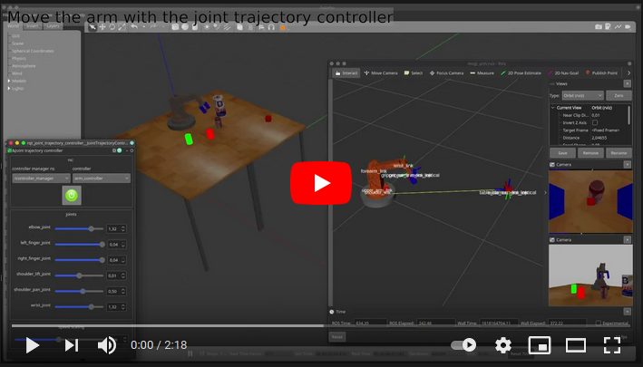

[//]: # (Image References)

[image1]: ./assets/gazebo1.png "Gazebo"
[image2]: ./assets/base_link_1.png "base_link"
[image3]: ./assets/base_link_2.png "base_link"
[image4]: ./assets/shoulder_1.png "shoulder"
[image5]: ./assets/shoulder_2.png "shoulder"
[image6]: ./assets/elbow_1.png "elbow"
[image7]: ./assets/elbow_2.png "elbow"
[image8]: ./assets/wrist_1.png "wrist"
[image9]: ./assets/wrist_2.png "wrist"
[image10]: ./assets/links.png "links"
[image11]: ./assets/gripper_1.png "gripper"
[image12]: ./assets/gripper_2.png "gripper"
[image13]: ./assets/rqt_1.png "rqt"
[image14]: ./assets/rqt_2.png "rqt"
[image15]: ./assets/3d_model_1.png "3D model"
[image16]: ./assets/3d_model_2.png "3D model"
[image17]: ./assets/init_1.png "Init"
[image18]: ./assets/dynamic_reconfigure_1.png "Dynamic reconfigure"
[image19]: ./assets/dynamic_reconfigure_2.png "Dynamic reconfigure"
[image20]: ./assets/grab_1.png "Grab"
[image21]: ./assets/grab_2.png "Grab"
[image22]: ./assets/grab_3.png "Grab"
[image23]: ./assets/attach_1.png "Attach"
[image24]: ./assets/attach_2.png "Attach"
[image25]: ./assets/attach_3.png "Attach"
[image26]: ./assets/attach_4.png "Attach"
[image27]: ./assets/collision_1.png "Collision"
[image28]: ./assets/collision_2.png "Collision"
[image29]: ./assets/ee_1.png "End effector"
[image30]: ./assets/ee_2.png "End effector"
[image31]: ./assets/ee_3.png "End effector"
[image32]: ./assets/camera_1.png "Camera"
[image33]: ./assets/camera_2.png "Camera"
[image34]: ./assets/camera_3.png "Camera"
[image35]: ./assets/joint_control_1.png "Joints"
[image36]: ./assets/joint_control_2.png "Joints"
[image37]: ./assets/joint_control_3.png "Joints"
[image38]: ./assets/ik_1.png "IK"
[image39]: ./assets/ik_2.png "IK"
[image40]: ./assets/ik_3.png "IK"

# 9. - 10. hét - robotkarok

# Hova fogunk eljutni?
<a href="https://youtu.be/tNUHpl0qe6A"></a> 

# Tartalomjegyzék
1. [Kezdőcsomag](#Kezdőcsomag)  
2. [Gazebo világ](#Gazebo-világ)
3. [Robot kar építése URDF-fel](#Robot-kar-építése-URDF-fel)  
3.1. [alap](#alap)  
3.2. [váll jointok](#váll-jointok)  
3.3. [könyök](#könyök)  
3.4. [csukló](#csukló)  
3.5. [megfogó](#megfogó)  
4. [Transmission és Controller](#Transmission-és-Controller)
5. [3D modell](#3D-modell)
6. [Kezdeti állapot](#Kezdeti-állapot)
7. [Megfogás](#Megfogás)  
7.1. [Fizikai szimulációval](#Fizikai-szimulációval)  
7.1.1. [PID hangolás](#PID-hangolás)  
7.2. [Tárgy rögzítésével](#Tárgy-rögzítésével)  
7.2.1. [Attach/detach](#Attach/detach)  
7.2.2. [Collsion érzékelés](#Collsion-érzékelés)  
8. [End effector](#End-effector)
9. [Szimulált kamerák](#Szimulált-kamerák)  
9.1. [RGBD kamera](#RGBD-kamera)
10. [Robotkar mozgatása ROS node-dal](#Robotkar-mozgatása-ROS-node-dal)
11. [Inverz kinematika](#Inverz-kinematika)  
11.1. [Teszt](#Teszt)  
11.2. [IK ROS node](#IK-ROS-node)


# Kezdőcsomag

A kiindulási csomag tartalmazza a Gazebo világot a launch fájlokat és az RViz konfigurációját, minden mást mi fogunk felépíteni közösen!

A kezdőprojekt letöltése:
```console
git clone -b starter-branch https://github.com/MOGI-ROS/Week-9-10-Simple-arm.git
```

A kezdőprojekt tartalma a következő:
```console
david@DavidsLenovoX1:~/bme_catkin_ws/src/Week-9-10-Simple-arm/bme_ros_simple_arm$ tree
.
├── CMakeLists.txt
├── controller
│   ├── arm_controller.yaml
│   ├── joint_state_controller.yaml
│   └── pid.yaml
├── launch
│   ├── check_urdf.launch
│   ├── spawn_robot.launch
│   └── world.launch
├── meshes
│   ├── forearm.blend
│   ├── forearm.dae
│   ├── forearm.SLDPRT
│   ├── forearm.STEP
│   ├── forearm.STL
│   ├── shoulder.blend
│   ├── shoulder.dae
│   ├── shoulder.SLDPRT
│   ├── shoulder.STEP
│   ├── shoulder.STL
│   ├── upper_arm.blend
│   ├── upper_arm.dae
│   ├── upper_arm.SLDPRT
│   ├── upper_arm.STEP
│   ├── upper_arm.STL
│   ├── wrist.blend
│   ├── wrist.dae
│   ├── wrist.SLDPRT
│   ├── wrist.STEP
│   └── wrist.STL
├── package.xml
├── rviz
│   ├── check_urdf.rviz
│   └── mogi_arm.rviz
├── urdf
│   ├── inertia_calculator.xlsx
│   ├── materials.xacro
│   └── transmission.xacro
└── worlds
    └── world.world
```

# Gazebo világ

A fejezetben egy új Gazebo világot fogunk használni, ami két asztalból és néhány megfogható testből áll:
![alt text][image1]

A szimulációt el tudjuk indítani a következő launch fájllal:
```console
roslaunch bme_ros_simple_arm world.launch
```

Vegyük észre, hogy van egy apró változás a `world.launch` fájlban, ugyanis a Gazebo szimulációnk megállítva indul!

```xml
<arg name="paused" value="true"/>
```

# Robot kar építése URDF-fel

![alt text][image10]

## alap

Hozzuk létre a robotunk első linkjét, ami a robotkar alapja lesz. A robotkar felépítése során hengerekkel fogunk dolgozni, és ennek megfelelően megpróbálunk reális értékeket választani a tömeg és a tehetetlenségi nyomaték mátrixának. Ehhez használhatjuk a mellékelt `inertia_calculator.xlsx` segítségképpen.

Hozzuk létre a `mogi_arm.xacro` fájlt az urdf mappában:

```xml
<?xml version="1.0"?>

<robot name="mogi_arm" xmlns:xacro="http://www.ros.org/wiki/xacro">

  <!-- RViz colors -->
  <xacro:include filename="$(find bme_ros_simple_arm)/urdf/materials.xacro" />

  <!-- Global reference link -->
  <link name="world"/>

  <joint name="fixed_base" type="fixed">
    <parent link="world"/>
    <child link="base_link"/>
  </joint>

  <!-- Arm base link -->
  <link name="base_link">
    <inertial>
      <mass value="2"/>
      <origin xyz="0.0 0.0 0.0"/>
      <inertia ixx="0.0117" ixy="0.0" ixz="0.0" 
               iyy="0.0117" iyz="0.0"
               izz="0.0225"
      />
    </inertial>
    <collision>
      <geometry>
        <cylinder radius="0.15" length="0.05"/>
      </geometry>
      <origin xyz="0.0 0.0 0.0" rpy="0.0 0.0 0.0"/>
    </collision>
    <visual>
      <geometry>
        <cylinder radius="0.15" length="0.05"/>
      </geometry>
      <material name="grey"/>
      <origin xyz="0.0 0.0 0.0" rpy="0.0 0.0 0.0"/>
    </visual>
  </link>

  <gazebo reference="base_link">
    <material>Gazebo/Grey</material>
  </gazebo>

</robot>
```

A `base_link`-ünk egy egyszerű lapos korong, de ennek ellenére megbizonyosodhatunk arról, hogy minden rendben van-e vele, ha megvizsgáljuk a `check_urdf.launch` segítségével:
![alt text][image2]

Illetve megnézhetjük a `spawn_robot.launch` fájlunkat is működés közben:
![alt text][image3]

## váll jointok

A robot válla két jointból fog állni, az egyik a `base_link` körüli forgatást, a másik a "felkar" mozgatását csinálja. Adjuk hozzá a két új linket és jointot az urdf fájlunkhoz:

```xml
  <!-- Shoulder pan joint -->
  <joint name="shoulder_pan_joint" type="revolute">
    <limit lower="-3.14" upper="3.14" effort="330.0" velocity="3.14"/>
    <parent link="base_link"/>
    <child link="shoulder_link"/>
    <axis xyz="0 0 1"/>
    <origin xyz="0.0 0.0 0.05" rpy="0.0 0.0 0.0"/>
    <dynamics damping="0.0" friction="0.0"/>
  </joint>

  <!-- Shoulder link -->
  <link name="shoulder_link">
    <inertial>
      <mass value="0.5"/>
      <origin xyz="0.0 0.0 0.0" rpy="0.0 0.0 0.0"/>
      <inertia ixx="0.0014" ixy="0.0" ixz="0.0"
               iyy="0.0014" iyz="0.0"
               izz="0.0025"
      />
    </inertial>
    <collision>
      <geometry>
        <cylinder radius="0.1" length="0.05"/>
      </geometry>
      <origin xyz="0.0 0.0 0.0" rpy="0.0 0.0 0.0"/>
    </collision>
    <visual>
      <geometry>
        <cylinder radius="0.1" length="0.05"/>
      </geometry>
      <material name="orange"/>
      <origin xyz="0.0 0.0 0.0" rpy="0.0 0.0 0.0"/>
    </visual>
  </link>

  <gazebo reference="shoulder_link">
    <material>Gazebo/Orange</material>
  </gazebo>

  <!-- Shoulder lift joint -->
  <joint name="shoulder_lift_joint" type="revolute">
    <limit lower="-1.5708" upper="1.5708" effort="330.0" velocity="3.14"/>
    <parent link="shoulder_link"/>
    <child link="upper_arm_link"/>
    <axis xyz="0 1 0"/>
    <origin xyz="0.0 0.0 0.025" rpy="0.0 0.0 0.0"/>
    <dynamics damping="0.0" friction="0.0"/>
  </joint>

  <!-- Upper arm link -->
  <link name="upper_arm_link">
    <inertial>
      <mass value="0.3"/>
      <origin xyz="0.0 0.0 0.1" rpy="0.0 0.0 0.0"/>
      <inertia ixx="0.0012" ixy="0.0" ixz="0.0"
               iyy="0.0012" iyz="0.0"
               izz="0.0004"
      />
    </inertial>
    <collision>
      <geometry>
        <cylinder radius="0.05" length="0.2"/>
      </geometry>
      <origin xyz="0.0 0.0 0.1" rpy="0.0 0.0 0.0"/>
    </collision>
    <visual>
      <geometry>
        <cylinder radius="0.05" length="0.2"/>
      </geometry>
      <material name="orange"/>
      <origin xyz="0.0 0.0 0.1" rpy="0.0 0.0 0.0"/>
    </visual>
  </link>

  <gazebo reference="upper_arm_link">
    <material>Gazebo/Orange</material>
  </gazebo>
```

A `check_urdf.launch` segítségével meg tudjuk mozgatni a robotkarunk vállának joint-jait:
![alt text][image4]

És a Gazebo szimulációban is elhelyezhetjük a `spawn_robot.launch` fájllal:
![alt text][image5]

Láthatjuk, hogy a Gazebo szimulációban nem tudjuk olyan egyszerűen mozgatni még a csuklókat, ehhez motorokat kell majd szimulálnunk a robotkar csuklóiban, de ezt csak azután tesszük meg, hogy elkészültünk a teljes karral!

## könyök

```xml
  <!-- Elbow joint -->
  <joint name="elbow_joint" type="revolute">
    <limit lower="-2.3562" upper="2.3562" effort="150.0" velocity="3.14"/>
    <parent link="upper_arm_link"/>
    <child link="forearm_link"/>
    <axis xyz="0 1 0"/>
    <origin xyz="0.0 0.0 0.2" rpy="0.0 0.0 0.0"/>
    <dynamics damping="0.0" friction="0.0"/>
  </joint>

  <!-- Forearm link -->
  <link name="forearm_link">
    <inertial>
      <mass value="0.2"/>
      <origin xyz="0.0 0.0 0.125" rpy="0.0 0.0 0.0"/>
      <inertia ixx="0.0011" ixy="0.0" ixz="0.0"
               iyy="0.0011" iyz="0.0"
               izz="0.0004"
      />
    </inertial>
    <collision>
      <geometry>
        <cylinder radius="0.025" length="0.25"/>
      </geometry>
      <origin xyz="0.0 0.0 0.125" rpy="0.0 0.0 0.0"/>
    </collision>
    <visual>
      <geometry>
        <cylinder radius="0.025" length="0.25"/>
      </geometry>
      <material name="orange"/>
      <origin xyz="0.0 0.0 0.125" rpy="0.0 0.0 0.0"/>
    </visual>
  </link>

  <gazebo reference="forearm_link">
    <material>Gazebo/Orange</material>
  </gazebo>
```

![alt text][image6]

![alt text][image7]

## csukló

```xml
  <!-- Wrist joint -->
  <joint name="wrist_joint" type="revolute">
    <limit lower="-2.3562" upper="2.3562" effort="54.0" velocity="3.14"/>
    <parent link="forearm_link"/>
    <child link="wrist_link"/>
    <axis xyz="0 1 0"/>
    <origin xyz="0.0 0.0 0.25" rpy="0.0 0.0 0.0"/>
    <dynamics damping="0.0" friction="0.0"/>
  </joint>

  <!-- Wrist link -->
  <link name="wrist_link">
    <inertial>
      <mass value="0.1"/>
      <origin xyz="0.0 0.0 0.05" rpy="0.0 0.0 0.0"/>
      <inertia ixx="0.00009" ixy="0.0" ixz="0.0"
               iyy="0.00009" iyz="0.0"
               izz="0.00002"
      />
    </inertial>
    <collision>
      <geometry>
        <cylinder radius="0.02" length="0.1"/>
      </geometry>
      <origin xyz="0.0 0.0 0.05" rpy="0.0 0.0 0.0"/>
    </collision>
    <visual>
      <geometry>
        <cylinder radius="0.02" length="0.1"/>
      </geometry>
      <material name="orange"/>
      <origin xyz="0.0 0.0 0.05" rpy="0.0 0.0 0.0"/>
    </visual>
  </link>

  <gazebo reference="wrist_link">
    <material>Gazebo/Orange</material>
  </gazebo>
```

![alt text][image8]

![alt text][image9]

## megfogó

Először adjuk hozzá a gripperünk alapját:

```xml
  <!-- Gripper base link -->
  <link name="gripper_base">
    <inertial>
      <mass value="0.1"/>
      <origin xyz="0.0 0.0 0.0" rpy="0.0 0.0 0.0"/>
      <inertia ixx="0.00009" ixy="0.0" ixz="0.0"
               iyy="0.00009" iyz="0.0"
               izz="0.00002"
      />
    </inertial>
    <collision>
      <geometry>
        <box size=".05 .1 .01"/>
      </geometry>
      <origin xyz="0.0 0.0 0.0" rpy="0.0 0.0 0.0"/>
    </collision>
    <visual>
      <geometry>
        <box size=".05 .1 .01"/>
      </geometry>
      <material name="grey"/>
      <origin xyz="0.0 0.0 0.0" rpy="0.0 0.0 0.0"/>
    </visual>
  </link>

  <gazebo reference="gripper_base">
    <material>Gazebo/Grey</material>
  </gazebo>
```

Majd ezek után a jobb és bal ujjakat:
```xml
  <!-- Left finger joint -->
  <joint name="left_finger_joint" type="prismatic">
    <limit lower="0" upper="0.04" effort="100.0" velocity="4.0"/>
    <parent link="gripper_base"/>
    <child link="left_finger"/>
    <axis xyz="0 1 0"/>
    <origin xyz="0.0 0.01 0.045" />
  </joint>

  <!-- Left finger link -->
  <link name="left_finger">
    <inertial>
      <mass value="0.1"/>
      <origin xyz="0.0 0.0 0.0" rpy="0.0 0.0 0.0"/>
      <inertia ixx="0.00009" ixy="0.0" ixz="0.0"
               iyy="0.00009" iyz="0.0"
               izz="0.00002"
      />
    </inertial>
    <collision>
      <geometry>
        <box size=".04 .01 .08"/>
      </geometry>
      <origin xyz="0.0 0.0 0.0" rpy="0.0 0.0 0.0"/>
    </collision>
    <visual>
      <geometry>
        <box size=".04 .01 .08"/>
      </geometry>
      <material name="blue"/>
      <origin xyz="0.0 0.0 0.0" rpy="0.0 0.0 0.0"/>
    </visual>
  </link>

  <gazebo reference="left_finger">
    <kp>1000000.0</kp>
    <kd>100.0</kd>
    <mu1>15</mu1>
    <mu2>15</mu2>
    <fdir1>1 0 0</fdir1>
    <maxVel>1.0</maxVel>
    <minDepth>0.002</minDepth>
    <material>Gazebo/Blue</material>
  </gazebo>

  <!-- Right finger joint -->
  <joint name="right_finger_joint" type="prismatic">
    <limit lower="0" upper="0.04" effort="100.0" velocity="4.0"/>
    <parent link="gripper_base"/>
    <child link="right_finger"/>
    <axis xyz="0 -1 0"/>
    <origin xyz="0.0 -0.01 0.045" />
  </joint>

  <!-- Right finger link -->
  <link name="right_finger">
    <inertial>
      <mass value="0.1"/>
      <origin xyz="0.0 0.0 0.0" rpy="0.0 0.0 0.0"/>
      <inertia ixx="0.00009" ixy="0.0" ixz="0.0"
               iyy="0.00009" iyz="0.0"
               izz="0.00002"
      />
    </inertial>
    <collision>
      <geometry>
        <box size=".04 .01 .08"/>
      </geometry>
      <origin xyz="0.0 0.0 0.0" rpy="0.0 0.0 0.0"/>
    </collision>
    <visual>
      <geometry>
        <box size=".04 .01 .08"/>
      </geometry>
      <material name="blue"/>
      <origin xyz="0.0 0.0 0.0" rpy="0.0 0.0 0.0"/>
    </visual>
  </link>

  <gazebo reference="right_finger">
    <kp>1000000.0</kp>
    <kd>100.0</kd>
    <mu1>15</mu1>
    <mu2>15</mu2>
    <fdir1>1 0 0</fdir1>
    <maxVel>1.0</maxVel>
    <minDepth>0.002</minDepth>
    <material>Gazebo/Blue</material>
  </gazebo>
```

Vegyük észre, hogy az ujjaknak megváltoztatjuk a mechanikai tulajdonságait, többek között a súrlódását, ami ahhoz kell, hogy fogni tudjunk majd a gripperrel.

![alt text][image11]

![alt text][image12]

# Transmission és Controller

Ahhoz, hogy a szimulált robotkarunkat meg tudjuk mozdítani végre kell hajtanunk néhány lépést.

Először is adjuk hozzá a `transmission.xacro` és a `mogi_arm.gazebo` fájlokat az urdf-ünkhöz:
```xml
  <!-- Transmisions -->
  <xacro:include filename="$(find bme_ros_simple_arm)/urdf/transmission.xacro" />
  <!-- Gazebo plugin -->
  <xacro:include filename="$(find bme_ros_simple_arm)/urdf/mogi_arm.gazebo" />
```

Ha ezután elindítjuk a `spawn_robot.launch` fájlt, a következő üzeneteket látjuk majd a konzolban:
```console
[ INFO] [1617044019.576815200]: Loading gazebo_ros_control plugin
[ INFO] [1617044019.577572300]: Starting gazebo_ros_control plugin in namespace: /
[ INFO] [1617044019.584272700]: gazebo_ros_control plugin is waiting for model URDF in parameter [robot_description] on the ROS param server.
[ERROR] [1617044019.730203800]: No p gain specified for pid.  Namespace: /gazebo_ros_control/pid_gains/shoulder_pan_joint
[ERROR] [1617044019.732750200]: No p gain specified for pid.  Namespace: /gazebo_ros_control/pid_gains/shoulder_lift_joint
[ERROR] [1617044019.735765000]: No p gain specified for pid.  Namespace: /gazebo_ros_control/pid_gains/elbow_joint
[ERROR] [1617044019.738999900]: No p gain specified for pid.  Namespace: /gazebo_ros_control/pid_gains/wrist_joint
[ERROR] [1617044019.742558100]: No p gain specified for pid.  Namespace: /gazebo_ros_control/pid_gains/left_finger_joint
[ERROR] [1617044019.748125500]: No p gain specified for pid.  Namespace: /gazebo_ros_control/pid_gains/right_finger_joint
[ INFO] [1617044019.772403000]: Loaded gazebo_ros_control.
```

Ez azt jelenti, hogy a szimulált hardware interfészeink működnek, a ROS control csomagja megtalálta őket, de ezzel még nincs vége a feladatnak, hiszen továbbra sem tudjuk mozgatni a kart. A mozgatáshoz az `rqt_joint_trajectory_controller`-ét fogjuk használni, amit így tudunk elindítani:

```console
rosrun rqt_joint_trajectory_controller rqt_joint_trajectory_controller
```

![alt text][image13]

Azonban ez még nem látja a controller-t. Ehhez fel kell paramétereznünk a `controller_manager`-t, amit a `spawn_robot.launch` módosításával tudunk megtenni:

```xml
  <!-- Send joint values-->
  <node name="joint_state_publisher" pkg="joint_state_publisher" type="joint_state_publisher">
    <param name="use_gui" value="false"/>
  </node>
```

Az eredeti `joint state publisher` node-ot cseréljük ki a következőre:

```xml
  <!-- Joint_state_controller -->
  <rosparam file="$(find bme_ros_simple_arm)/controller/joint_state_controller.yaml" command="load"/>
  <node name="joint_state_controller_spawner" pkg="controller_manager" type="controller_manager" args="spawn joint_state_controller" respawn="false" output="screen"/>

  <!-- Start this controller -->
  <rosparam file="$(find bme_ros_simple_arm)/controller/arm_controller.yaml" command="load"/>
  <node name="arm_controller_spawner" pkg="controller_manager" type="controller_manager" args="spawn arm_controller" respawn="false" output="screen"/>
```

Ha most indítjuk el a `spawn_robot.launch` fájlt, akkor láthatjuk, hogy megmaradt továbbra is a figyelmeztetés:
```console
No p gain specified for pid.
```

Másrészt viszont működik a controllerünk, és tudjuk mozgatni a robotkart a fizikai szimulációban!

![alt text][image14]

# 3D modell

Mielőtt továbbmennénk a gripper használatához, cseréljük le az egyszerű narancssárga hengereket 3D modellekre!
Ezeket a meshes mappában találjuk, itt vannak az eredeti CAD fájlok és az abból készített Collada meshek is.

Ezeket a sorokat kell beillesztenünk a megfelelő helyekre az urdf-ben:
```xml
<mesh filename = "package://bme_ros_simple_arm/meshes/shoulder.dae"/>
<mesh filename = "package://bme_ros_simple_arm/meshes/upper_arm.dae"/>
<mesh filename = "package://bme_ros_simple_arm/meshes/forearm.dae"/>
<mesh filename = "package://bme_ros_simple_arm/meshes/wrist.dae"/>
```

Természetesen ne felejtsük el kitörölni (vagy kikommentelni) az eredeti hengereket:
```xml
<!--cylinder radius="0.1" length="0.05"/-->
```

Illetve a színek megfelelő kezelése miatt a Gazebo színeket is:
```xml
<!--gazebo reference="shoulder_link">
  <material>Gazebo/Orange</material>
</gazebo-->
```

Ezek után nézzük meg a kart a `check_urdf.launch` fájllal:
![alt text][image15]

Ha elégedettek vagyunk az eredménnyel, akkor nézzük meg a szimulációban is!
![alt text][image16]

# Kezdeti állapot

Kiegészíthetjük az urdf_spawner-ünket további paraméterekkel, megadhatjuk a jointok kezdeti szögét (tehát nem az urdf fájlban kell módosítanunk hozzá), illetve akár el is indíthatjuk a szimulációt a spawn végén.

```xml
  <!-- Spawn mogi_arm -->
  <node name="urdf_spawner" pkg="gazebo_ros" type="spawn_model" respawn="false" output="screen" 
    args="-urdf -param robot_description -model mogi_arm 
            -x $(arg x) -y $(arg y) -z $(arg z)
            -R $(arg roll) -P $(arg pitch) -Y $(arg yaw)
            -J elbow_joint 1.5707
            -unpause"/>
```

Ennek ellenére ezt a megoldást, ha lehetséges, érdemes elkerülnünk, van egy [terjedelmes GitHub](https://github.com/ros-simulation/gazebo_ros_pkgs/issues/93) issue róla, miért nem működik ez kellően robosztusan.

![alt text][image17]

# Megfogás

Fizikai szimulációban a gripperrel történő megfogás szimulációja egy nagyon nehéz feladat, ezért a legtöbb esetben az ilyen fogásokat nem is fizikával hajtják végre, hanem egy ütközésdetektálás után létrehozhatunk egy fix jointot a megfogó és a megfogandó tárgy között.

Mind a két módszerre nézünk példát, először kezdjük a nehezebb úttal!

## Fizikai szimulációval
A fizikai szimulációval való fogás azért a nehezebb út, mert position joint interface-eket használunk az egyes csuklókban. Emlékeztetőül, így adtuk meg a jointokat a `transmission.xacro` fájlban:

```xml
<hardwareInterface>hardware_interface/PositionJointInterface</hardwareInterface>
```

Használhatnánk más joint típust is, például EffortJointInterface-t, de ezt később a MoveIt!-tal való ismerkedés miatt nem lenne célravezető.

A position joint interface miatt látjuk a Gazebo figyelmeztetését:
```console
[ERROR] [1617090695.832931300]: No p gain specified for pid.
```
Abban az esetben ugyanis, ha nem adjuk meg a szabályozó paramétereket, a Gazebo egy úgy nevezett *kinematic* modellként kezeli a robotunkat, nem működik rá fizikai szimuláció, kizárólag a transzformációk mozgatják. Ebben az esetben a fizikai motor nem tudja kiszámolni a csuklókban ébredő erőket és nyomatékokat, emiatt a fogás sem fog működni, ahol a súrlódás segítségével maradna a megfogóban a megfogott alkatrész.

Ezt könnyedén kipróbálhatjuk, ha elindítjuk a szimulációt, és megpróbáljuk megfogni az egyik objektumot:
![alt text][image20]

Hiába zárjuk össze a gripper ujjait, ha megpróbáljuk felemelni a piros hasábot, az egyszerűen *kicsúszik* az ujjak közül. Ha megpróbáljuk növelni a szorítást, akkor pedig *kiugrik* a megfogóból:
![alt text][image21]

Ahhoz, hogy a fizikai motor meg tudja határozni az erőket és nyomatékokat be kell hangoljuk a szimulált poisition joint interface-ek szimulált PID szabályozóját!

### PID hangolás

Erre szerencsére a ROS esetén fel tudjuk használni a már megismert `rqt_reconfigure` csomagot, amit így indíthatunk el:
```console
rosrun rqt_reconfigure rqt_reconfigure
```
![alt text][image18]

Azonban itt még nem látjuk a szabályozók paramétereit. Ehhez be kell töltsünk egy kezdeti paraméterlistát, ami a `pid.yaml` fájlban található a `controller` mappában.

Adjuk hozzá tehát ennek a betöltését a `spawn_robot.launch` fájlhoz:
```xml
<rosparam file="$(find bme_ros_simple_arm)/controller/pid.yaml"/>
```

Majd indítsuk újra a szimulációt és az `rqt_reconfigure`-t.
![alt text][image19]

Ha sikerült elfogadható PID szabályozót hangolnunk, akkor ki is tudjuk próbálni, hogy működik-e a fogás:
![alt text][image22]

Láthatjuk, hogy sikerült a fizikai szimuláció és a súrlódás segítségével megemelnünk a piros hasábot, ez hatalmas eredmény a saját részünkről és a fizikai motor részéről is!

## Tárgy rögzítésével
A könnyebbik út az, ha maradunk a robotunk kinematikai szimulációjánál, nem hangolunk PID szabályozót, és helyette fogás esetén létrehozunk egy fix linket a megfogó és a megfogandó tárgy között. Nem szabad ezt a *könnyebbik* utat lebecsülni azonban, hiszen valójában a szimulált PID szabályozóink és a fizikai szimuláció hangolgatásából nem sok eredményt tudunk visszavezetni a valódi robotkarunk esetére.

Ez a könnyebbik út viszont némi programozással jár, illetve szükségünk lesz egy olyan csomagra, amit forrásból kell fordítanunk:
[https://github.com/MOGI-ROS/gazebo_ros_link_attacher](https://github.com/MOGI-ROS/gazebo_ros_link_attacher)

Ha sikerült lefordítanunk a csomagot, akkor ezt a plugin-t még el kell helyeznünk a Gazebo világunkban is, mondjuk valahol a fájl végén a </world> tag előtt:

```xml
    ...
    <!-- A gazebo links attacher -->
    <plugin name="ros_link_attacher_plugin" filename="libgazebo_ros_link_attacher.so"/>
  </world>
</sdf>
```

### Attach/detach

A fix jointok létrehozásához szükségünk lesz a modellek és azon belünk a linkek neveire, amik között a kapcsolatot létre akarjuk hozni. Ezt nagyon könnyen kideríthetjük a Gazeboból:

![alt text][image23]

Ezek után nézzük meg a ROS service-ek listáját is:
```console
david@DavidsLenovoX1:~/bme_catkin_ws$ rosservice list
...
/link_attacher_node/attach
/link_attacher_node/detach
...
```

Tehát a modell és link nevek alapján parancssorból is hívhatnánk ezt a ROS service-t a következő formában:
```bash
rosservice call /link_attacher_node/attach "model_name_1: 'cube1'
    link_name_1: 'link'
    model_name_2: 'cube2'
    link_name_2: 'link'"
```

De ehelyett csinálunk egy python scriptet inkább. Hozzuk létre az `attach.py` fájlt a `scripts` mappában:
```python
#!/usr/bin/env python

import rospy
from gazebo_ros_link_attacher.srv import Attach, AttachRequest, AttachResponse


if __name__ == '__main__':
    rospy.init_node('demo_attach_links')
    rospy.loginfo("Creating ServiceProxy to /link_attacher_node/attach")
    attach_srv = rospy.ServiceProxy('/link_attacher_node/attach',
                                    Attach)
    attach_srv.wait_for_service()
    rospy.loginfo("Created ServiceProxy to /link_attacher_node/attach")

    # Link them
    rospy.loginfo("Attaching gripper and red box.")
    req = AttachRequest()
    req.model_name_1 = "mogi_arm"
    req.link_name_1 = "left_finger"
    req.model_name_2 = "red_box"
    req.link_name_2 = "link"

    attach_srv.call(req)
```

Ennek megfelelően csináljuk meg a `detach.py` fájlt is:
```python
#!/usr/bin/env python

import rospy
from gazebo_ros_link_attacher.srv import Attach, AttachRequest, AttachResponse


if __name__ == '__main__':
    rospy.init_node('demo_detach_links')
    rospy.loginfo("Creating ServiceProxy to /link_attacher_node/detach")
    attach_srv = rospy.ServiceProxy('/link_attacher_node/detach',
                                    Attach)
    attach_srv.wait_for_service()
    rospy.loginfo("Created ServiceProxy to /link_attacher_node/detach")

    # Link them
    rospy.loginfo("Detaching gripper and red box.")
    req = AttachRequest()
    req.model_name_1 = "mogi_arm"
    req.link_name_1 = "left_finger"
    req.model_name_2 = "red_box"
    req.link_name_2 = "link"

    attach_srv.call(req)
```

Szedjük ki a PID szabályozónk paramétereit a próba előtt!
```xml
<!--rosparam file="$(find bme_ros_simple_arm)/controller/pid.yaml"/-->
```

Indítsuk el a szimulációt, állítsuk be a kart a megfelelő helyre, és futtassuk le az `attach.py` ROS node-unkat!

A ROS node futtatásának az eredménye:
```console
david@DavidsLenovoX1:~/bme_catkin_ws$ rosrun bme_ros_simple_arm attach.py
[INFO] [1617095533.304533, 0.000000]: Creating ServiceProxy to /link_attacher_node/attach
[INFO] [1617095533.331539, 0.000000]: Created ServiceProxy to /link_attacher_node/attach
[INFO] [1617095533.335856, 419.808000]: Attaching gripper and red box.
```

És ezzel egy időben ezt látjuk a Gazebo szimuláció termináljában:
```console
[ INFO] [1617095533.351375100, 419.821000000]: Received request to attach model: 'mogi_arm' using link: 'left_finger' with model: 'red_box' using link: 'link'
[ INFO] [1617095533.352090600, 419.821000000]: Creating new joint.
[ INFO] [1617095533.373408200, 419.830000000]: Attach finished.
[ INFO] [1617095533.379024700, 419.836000000]: Attach was succesful
```
Az attach és a piros hasáb megfogása sikerült!
![alt text][image24]


Próbáljuk ki a `detach.py`-t is:
```console
david@DavidsLenovoX1:~/bme_catkin_ws$ rosrun bme_ros_simple_arm detach.py
[INFO] [1617095634.126688, 0.000000]: Creating ServiceProxy to /link_attacher_node/detach
[INFO] [1617095634.144994, 0.000000]: Created ServiceProxy to /link_attacher_node/detach
[INFO] [1617095634.160449, 0.000000]: Detaching gripper and red box.
```

A Gazebo termináljában ezt látjuk:
```console
[ INFO] [1617095634.224778700, 476.994000000]: Received request to detach model: 'mogi_arm' using link: 'left_finger' with model: 'red_box' using link: 'link'
[ INFO] [1617095634.225193200, 476.994000000]: Detach was succesful
```
![alt text][image25]

Természetesen az `attach.py` és a `detach.py` nem foglalkozik azzal, hogy hogy állítottuk be a kart, tehát attach-olhatjuk a piros hasábot akkor is, ha a gripper a közelében sem tartózkodik. Természetesen ez nem túl elegáns megoldás:
![alt text][image26]

### Collsion érzékelés
Erre egy jó megoldás lehet az, ha szimulálunk egy "ütközőt" a gripperünk egyik (vagy mindkét ujjában).

Adjuk hozzá a contact sensor plugint a `mogi_arm.xacro` fájlhoz:
```xml
  <gazebo reference="left_finger">
    <sensor name="left_finger" type="contact">
      <always_on>true</always_on>
      <update_rate>15.0</update_rate> 
      <contact>
        <collision>left_finger_collision</collision>
      </contact>
      <plugin name="gazebo_ros_bumper_controller" filename="libgazebo_ros_bumper.so">  
        <bumperTopicName>contact_vals</bumperTopicName>
        <frameName>world</frameName>
      </plugin>
    </sensor>
  </gazebo>
```

A `left_finger` tehát ha bármivel ütközést érzékel, azt a `contact_vals` topicba fogja küldeni. Nézzük meg ezt a topicot `rqt`-ben:
![alt text][image27]

A `states` tömb üres, ha nincs ütközés, most mozgassuk a kart a piros hasábhoz, és érintsük hozzá a bal ujjat:
![alt text][image28]

Készítsünk egy saját ROS node-ot, ami a bal ujj ütközéseit vizsgálja, és kiírja nekünk, hogy mivel érzékel ütközést:

```python
#!/usr/bin/env python

import rospy

from gazebo_msgs.msg import ContactsState

def get_contacts (msg):
    if (len(msg.states) == 0):
        rospy.loginfo("No contacts were detected!")
    else:
        if 'left_finger' in msg.states[0].collision1_name:
            rospy.loginfo("Collision detected with %s." % msg.states[0].collision2_name.split("::")[0])
        elif 'left_finger' in msg.states[0].collision2_name:
            rospy.loginfo("Collision detected with %s." % msg.states[0].collision1_name.split("::")[0])
        else:
            rospy.loginfo("Unknown collision")


rospy.init_node('collision_detector')

sub_contacts = rospy.Subscriber ('/contact_vals', ContactsState, get_contacts)

rospy.spin()
```

Indítsuk el és nézzük meg a kimenetét:
```console
david@DavidsLenovoX1:~/bme_catkin_ws$ rosrun bme_ros_simple_arm detect_contacts.py
[INFO] [1617096765.822937, 414.627000]: No contacts were detected!
...
[INFO] [1617096776.481473, 421.602000]: No contacts were detected!
[INFO] [1617096776.576807, 421.669000]: Collision detected with red_box.
[INFO] [1617096776.678381, 421.736000]: Collision detected with red_box.
[INFO] [1617096776.788307, 421.813000]: Collision detected with red_box.
[INFO] [1617096776.883865, 421.871000]: Collision detected with red_box.
[INFO] [1617096776.982253, 421.941000]: Collision detected with red_box.
[INFO] [1617096777.099881, 422.006000]: Collision detected with red_box.
```

Ezt tehát összeköthetjük a korábbi `attach.py` node-unkkal, és dinamikusan tudjuk állítani a megfogandó tárgy nevét.

# End effector
Nagyban megkönnyítheti a dolgunkat, ha csinálunk egy olyan link-et a robotkarunkon, ami csak arra jó, hogy mutassa a gripperünk megfogási pontját, ezt nevezzük robotkarok esetén TCP-nek (tool center point).

Tegyünk egy kis piros kockát a gripper ujjai közé, amit látunk ugyan RVizben és a szimulációban, de nem ütközik semmivel! Egészítsük ki a `mogi_arm.xacro` fájlunkat:

```xml
  <!-- End effector joint -->
  <joint name="end_effector_joint" type="fixed">
    <origin xyz="0.0 0.0 0.175" rpy="0 0 0"/>
    <parent link="wrist_link"/>
    <child link="end_effector_link"/>
  </joint>

  <!-- End effector link -->
  <link name="end_effector_link">
    <visual>
      <origin xyz="0 0 0" rpy="0 0 0"/>
      <geometry>
        <box size="0.01 0.01 0.01" />
      </geometry>
      <material name="red"/>
     </visual>

    <inertial>
      <origin xyz="0 0 0" />
      <mass value="1.0e-03" />
      <inertia ixx="1.0e-03" ixy="0.0" ixz="0.0"
               iyy="1.0e-03" iyz="0.0"
               izz="1.0e-03" />
    </inertial>
  </link>

  <gazebo reference="end_effector_link">
    <material>Gazebo/Red</material>
  </gazebo>
```
Láthatjuk, hogy az `end_effector_link`-nek nincs collision property-je! Nézzük meg a szimulációban!
![alt text][image29]

És ugyanez RViz-ben:
![alt text][image30]
Próbáljuk is ki, hogy ez a kis piros kocka valóban nem ütközik semmivel!
![alt text][image31]

# Szimulált kamerák
Adjunk hozzá egy gripper kamerát és egy fix, asztalhoz rögzített kamerát a szimulációnkhoz, így RViz-ben is látni fogjuk mi történik!
Ehhez a már jól megszokott módon létrehozzuk a `camera` és `camera_optical` linkeket az URDF fájlban, és hozzáadjuk a kamerák szimulációját a `mogi_arm.gazebo` fájlhoz is!

```xml
  <!-- Gripper camera -->
  <joint type="fixed" name="gripper_camera_joint">
    <origin xyz="0.0 0.0 0.0" rpy="0 -1.5707 0"/>
    <child link="gripper_camera_link"/>
    <parent link="gripper_base"/>
  </joint>

  <link name='gripper_camera_link'>
    <pose>0 0 0 0 0 0</pose>
    <inertial>
      <mass value="1.0e-03"/>
      <origin xyz="0 0 0" rpy="0 0 0"/>
      <inertia
          ixx="1e-6" ixy="0" ixz="0"
          iyy="1e-6" iyz="0"
          izz="1e-6"
      />
    </inertial>

    <visual>
      <origin xyz="0 0 0" rpy="0 0 0"/>
      <geometry>
        <box size=".01 .01 .01"/>
      </geometry>
    </visual>

  </link>

  <gazebo reference="gripper_camera_link">
    <material>Gazebo/Red</material>
  </gazebo>

  <joint type="fixed" name="gripper_camera_optical_joint">
    <origin xyz="0 0 0" rpy="-1.5707 0 -1.5707"/>
    <child link="gripper_camera_link_optical"/>
    <parent link="gripper_camera_link"/>
  </joint>

  <link name="gripper_camera_link_optical">
  </link>

  <!-- Table camera -->
  <joint type="fixed" name="table_camera_joint">
    <origin xyz="1.0 0.4 0.2" rpy="0 0 3.6652"/>
    <child link="table_camera_link"/>
    <parent link="world"/>
  </joint>

  <link name='table_camera_link'>
    <pose>0 0 0 0 0 0</pose>
    <inertial>
      <mass value="1.0e-03"/>
      <origin xyz="0 0 0" rpy="0 0 0"/>
      <inertia
          ixx="1e-6" ixy="0" ixz="0"
          iyy="1e-6" iyz="0"
          izz="1e-6"
      />
    </inertial>

    <visual>
      <origin xyz="0 0 0" rpy="0 0 0"/>
      <geometry>
        <box size=".05 .05 .05"/>
      </geometry>
    </visual>

  </link>

  <gazebo reference="table_camera_link">
    <material>Gazebo/Red</material>
  </gazebo>

  <joint type="fixed" name="table_camera_optical_joint">
    <origin xyz="0 0 0" rpy="-1.5707 0 -1.5707"/>
    <child link="table_camera_link_optical"/>
    <parent link="table_camera_link"/>
  </joint>

  <link name="table_camera_link_optical">
  </link>
```
Valamint:
```xml
  <!-- Gripper camera -->
  <gazebo reference="gripper_camera_link">
    <sensor type="camera" name="gripper_camera">
      <update_rate>30.0</update_rate>
      <visualize>false</visualize>
      <camera name="gripper_camera">
        <horizontal_fov>1.3962634</horizontal_fov>
        <image>
          <width>640</width>
          <height>480</height>
          <format>R8G8B8</format>
        </image>
        <clip>
          <near>0.005</near>
          <far>5.0</far>
        </clip>
        <noise>
          <type>gaussian</type>
          <!-- Noise is sampled independently per pixel on each frame.
               That pixel's noise value is added to each of its color
               channels, which at that point lie in the range [0,1]. -->
          <mean>0.0</mean>
          <stddev>0.007</stddev>
        </noise>
      </camera>
      <plugin name="camera_controller" filename="libgazebo_ros_camera.so">
        <alwaysOn>true</alwaysOn>
        <updateRate>0.0</updateRate>
        <cameraName>gripper_camera</cameraName>
        <imageTopicName>image_raw</imageTopicName>
        <cameraInfoTopicName>camera_info</cameraInfoTopicName>
        <frameName>gripper_camera_link_optical</frameName>
        <hackBaseline>0.07</hackBaseline>
        <distortionK1>0.0</distortionK1>
        <distortionK2>0.0</distortionK2>
        <distortionK3>0.0</distortionK3>
        <distortionT1>0.0</distortionT1>
        <distortionT2>0.0</distortionT2>
      </plugin>
    </sensor>
  </gazebo>

  <!-- Table camera -->
  <gazebo reference="table_camera_link">
    <sensor type="camera" name="table_camera">
      <update_rate>30.0</update_rate>
      <visualize>false</visualize>
      <camera name="table_camera">
        <horizontal_fov>1.3962634</horizontal_fov>
        <image>
          <width>640</width>
          <height>480</height>
          <format>R8G8B8</format>
        </image>
        <clip>
          <near>0.005</near>
          <far>5.0</far>
        </clip>
        <noise>
          <type>gaussian</type>
          <!-- Noise is sampled independently per pixel on each frame.
               That pixel's noise value is added to each of its color
               channels, which at that point lie in the range [0,1]. -->
          <mean>0.0</mean>
          <stddev>0.007</stddev>
        </noise>
      </camera>
      <plugin name="camera_controller" filename="libgazebo_ros_camera.so">
        <alwaysOn>true</alwaysOn>
        <updateRate>0.0</updateRate>
        <cameraName>table_camera</cameraName>
        <imageTopicName>image_raw</imageTopicName>
        <cameraInfoTopicName>camera_info</cameraInfoTopicName>
        <frameName>table_camera_link_optical</frameName>
        <hackBaseline>0.07</hackBaseline>
        <distortionK1>0.0</distortionK1>
        <distortionK2>0.0</distortionK2>
        <distortionK3>0.0</distortionK3>
        <distortionT1>0.0</distortionT1>
        <distortionT2>0.0</distortionT2>
      </plugin>
    </sensor>
  </gazebo>
```
![alt text][image32]

![alt text][image33]

## RGBD kamera
Cseréljük le az asztali kameránkat egy RGBD kamerára!
Ehhez az asztali kamera pluginjét változtassuk meg a következőre:

```xml
  <!-- Table RGBD camera -->
  <gazebo reference="table_camera_link">
    <sensor type="depth" name="table_camera">
      <always_on>1</always_on>
      <update_rate>20.0</update_rate>
      <visualize>false</visualize>             
      <camera>
        <horizontal_fov>1.047</horizontal_fov>  
        <image>
          <width>640</width>
          <height>480</height>
          <format>B8G8R8</format>
        </image>
        <clip>
          <near>0.5</near>
          <far>10.0</far>
        </clip>
      </camera>
      <plugin name="camera_controller" filename="libgazebo_ros_openni_kinect.so">
        <baseline>0.2</baseline>
        <alwaysOn>true</alwaysOn>
        <updateRate>0.0</updateRate>
        <cameraName>depth_camera</cameraName>
        <frameName>table_camera_link_optical</frameName>                   
        <imageTopicName>rgb/image_raw</imageTopicName>
        <depthImageTopicName>depth/image_raw</depthImageTopicName>
        <pointCloudTopicName>depth/points</pointCloudTopicName>
        <cameraInfoTopicName>rgb/camera_info</cameraInfoTopicName>              
        <depthImageCameraInfoTopicName>depth/camera_info</depthImageCameraInfoTopicName>            
        <pointCloudCutoff>0.5</pointCloudCutoff>
        <pointCloudCutoffMax>10.0</pointCloudCutoffMax>
        <hackBaseline>0.0</hackBaseline>
        <distortionK1>0.0</distortionK1>
        <distortionK2>0.0</distortionK2>
        <distortionK3>0.0</distortionK3>
        <distortionT1>0.0</distortionT1>
        <distortionT2>0.0</distortionT2>
        <CxPrime>0.0</CxPrime>
        <Cx>0.0</Cx>
        <Cy>0.0</Cy>
        <focalLength>0.0</focalLength>
      </plugin>
    </sensor>
  </gazebo>
```

![alt text][image34]

# Robotkar mozgatása ROS node-dal
Eddig a kar joint-jait az `rqt_joint_trajectory_controller` segítségével mozgattuk, de nézzük meg hogyan mozgathatnánk ezt a saját ROS node-unkból!

Ehhez először nézzük meg alaposabban az `rqt_joint_trajectory_controller`-t! Indítsuk el a szimulációt és az `rqt_joint_trajectory_controller`-t is, és nézzük meg a ROS node-ok listáját:

```console
david@DavidsLenovoX1:~/bme_catkin_ws$ rosnode list
/gazebo
/gazebo_gui
/robot_state_publisher
/rosout
/rqt_gui_py_node_7444
/rviz
```

Nézzük meg a `rqt_gui_py_node_7444`-t alaposabban:
```console
david@DavidsLenovoX1:~/bme_catkin_ws$ rosnode info /rqt_gui_py_node_7444
--------------------------------------------------------------------------------
Node [/rqt_gui_py_node_7444]
Publications:
 * /arm_controller/command [trajectory_msgs/JointTrajectory]
 * /rosout [rosgraph_msgs/Log]

Subscriptions:
 * /arm_controller/state [control_msgs/JointTrajectoryControllerState]
 * /clock [rosgraph_msgs/Clock]

Services:
 * /rqt_gui_py_node_7444/get_loggers
 * /rqt_gui_py_node_7444/set_logger_level

...
```

Ezek közül számunkra az `/arm_controller/command` topic érdekes elsősorban, ami `trajectory_msgs/JointTrajectory` típusú!

A további keresgéléshez használjuk az `rqt`-t:
![alt text][image35]

Láthatjuk, hogy ebben a topicban egyrészt felsoroljuk a controllerhez tartozó jointokat, illetve azok szögét. Az `effort`, `velocities` és `accelerations` mezőkkel most nem foglalkozunk! A `time_from_start` értéke pedig a `speed scaling` csúszka alapján állítódik be. Nincs tehát más dolgunk, mint ilyen `JointTrajectory` üzeneteket küldeni az `/arm_controller/command` topicba!

Készítsük el a `send_joint_angles.py` node-unkat:
```python
#!/usr/bin/env python

import rospy

from trajectory_msgs.msg import JointTrajectory, JointTrajectoryPoint

rospy.init_node('send_joint_angles')

pub = rospy.Publisher('/arm_controller/command', JointTrajectory, queue_size=1)

controller_name = "arm_controller"
joint_names = rospy.get_param("/%s/joints" % controller_name)

rospy.loginfo("Joint names: %s" % joint_names)

rate = rospy.Rate(10)

trajectory_command = JointTrajectory()

trajectory_command.joint_names = joint_names
trajectory_command.header.stamp = rospy.Time.now()

point = JointTrajectoryPoint()
#['shoulder_pan_joint', 'shoulder_lift_joint', 'elbow_joint', 'wrist_joint', 'left_finger_joint', 'right_finger_joint']
point.positions = [0.0, 0.91, 1.37, -0.63, 0.3, 0.3]
point.velocities = [0.0, 0.0, 0.0, 0.0, 0.0, 0.0]
point.time_from_start = rospy.rostime.Duration(1,0)

trajectory_command.points = [point]

while not rospy.is_shutdown():
    pub.publish(trajectory_command)
    rate.sleep()
```
![alt text][image36]

Próbáljuk ki egy másik pozícióban is:
```python
point.positions = [-0.45, 0.72, 1.84, -1.0, 0.3, 0.3]
```
![alt text][image37]

# Inverz kinematika
Gyakorlatban azonban nem igazán kényelmes a jointok szögére hivatkozni a kar mozgatásakor. Arra, hogy a robotkarunk megfogóját (TCP) a kívánt pozícióba juttassuk meg kell oldanunk a robotkarunk inverz kinematikai problémáját. Szerencsére egy nagyon egyszerű geometriával rendelkező robotkart építettünk, így az inverz kinematika megoldását egyszerűen, néhány szögfüggvény segítségével kiszámíthatjuk!

![alt text][image40]

A 4 szabadási fokú karunk esetén az első joint csak a robotkar forgatására szolgál, így a TCP kívánt y koordinátája alapján meghatározhatjuk az első joint (`j0`) szögét. Az x és y koordinátákból tehát számolható:

```python
j0 = math.atan(coords[1]/coords[0])
```

Ahol a `coords` egy olyan lista, ami a TCP kívánt koordinátáit tartalmazzák `[x, y, z]`.

![alt text][image39]

Az inverz kinematikai megoldó függvényünknek a gripperünk szöge egy paraméter, ami nem a `wrist`-hez képesti szöget jelenti, hanem a robot álló talpához rögzített koordinátarendszerhez képest. Ennek megfelelően tehát a `0 rad` gripper szög mindig a vízszintes, a `pi/2 rad` pedig mindig a lefelé néző függőleges grippert jelenti. Mivel a 4. csukló (`j3`) szögét ez alapján határozzuk meg, az inverz kinematikai problémát már csak 2 csuklóra (`j1` és `j2`) kell megoldanunk.

Ehhez újraszámoljuk a koordinátákat, az egyszerűség kedvéért a `wrist` csuklóra.

![alt text][image38]

```python
def inverse_kinematics(coords, gripper_status, gripper_angle = 0):
    '''
    Calculates the joint angles according to the desired TCP coordinate and gripper angle
    :param coords: list, desired [X, Y, Z] TCP coordinates
    :param gripper_status: string, can be `closed` or `open`
    :param gripper_angle: float, gripper angle in woorld coordinate system (0 = horizontal, pi/2 = vertical)
    :return: list, the list of joint angles, including the 2 gripper fingers
    '''
    # link lengths
    ua_link = 0.2
    fa_link = 0.25
    tcp_link = 0.175
    # z offset (robot arm base height)
    z_offset = 0.1
    # default return list
    angles = [0,0,0,0,0,0]

    # Calculate the shoulder pan angle from x and y coordinates
    j0 = math.atan(coords[1]/coords[0])

    # Re-calculate target coordinated to the wrist joint (x', y', z')
    x = coords[0] - tcp_link * math.cos(j0) * math.cos(gripper_angle)
    y = coords[1] - tcp_link * math.sin(j0) * math.cos(gripper_angle)
    z = coords[2] - z_offset + math.sin(gripper_angle) * tcp_link

    # Solve the problem in 2D using x" and z'
    x = math.sqrt(y*y + x*x)

    # Let's calculate auxiliary lengths and angles
    c = math.sqrt(x*x + z*z)
    alpha = math.asin(z/c)
    beta = math.pi - alpha
    # Apply law of cosines
    gamma = math.acos((ua_link*ua_link + c*c - fa_link*fa_link)/(2*c*ua_link))

    j1 = math.pi/2.0 - alpha - gamma
    j2 = math.pi - math.acos((ua_link*ua_link + fa_link*fa_link - c*c)/(2*ua_link*fa_link)) # j2 = 180 - j2'
    delta = math.pi - (math.pi - j2) - gamma # delta = 180 - j2' - gamma

    j3 = math.pi + gripper_angle - beta - delta

    angles[0] = j0
    angles[1] = j1
    angles[2] = j2
    angles[3] = j3

    if gripper_status == "open":
        angles[4] = 0.04
        angles[5] = 0.04
    elif gripper_status == "closed":
        angles[4] = 0.01
        angles[5] = 0.01
    else:
        angles[4] = 0.04
        angles[5] = 0.04

    return angles
```

Az inverz kinematikai megoldófggvényünket érdemes letesztelnünk a direkt kinematikai megoldóképletünkkel, ami sokkal egyszerűbb a robotkarunkra:

```python
def forward_kinematics(joint_angles):
    '''
    Calculates the TCP coordinates from the joint angles
    :param joint_angles: list, joint angles [j0, j1, j2, j3, ...]
    :return: list, the list of TCP coordinates
    '''
    ua_link = 0.2
    fa_link = 0.25
    tcp_link = 0.175
    z_offset = 0.1

    x = math.cos(joint_angles[0]) * (math.sin(joint_angles[1]) * ua_link + math.sin(joint_angles[1] + joint_angles[2]) * fa_link + math.sin(joint_angles[1] + joint_angles[2] + joint_angles[3]) * tcp_link)
    y = math.sin(joint_angles[0]) * (math.sin(joint_angles[1]) * ua_link + math.sin(joint_angles[1] + joint_angles[2]) * fa_link + math.sin(joint_angles[1] + joint_angles[2] + joint_angles[3]) * tcp_link)
    z = z_offset + math.cos(joint_angles[1]) * ua_link + math.cos(joint_angles[1] + joint_angles[2]) * fa_link + math.cos(joint_angles[1] + joint_angles[2] + joint_angles[3]) * tcp_link

    return [x,y,z]
```

Még egy 4 szabadságifokú robotkar esetén is egészen hosszúak lesznek a képletek az egyes koordináták kiszámítására.

## Teszt
Készítsük el a `forward_kinematics.py` fájlt, amiben le tudjuk tesztelni a fenti két függvényünket!

```python
#!/usr/bin/env python

import math
```

Másoljuk bele a fenti két függvényt is, majd próbáljuk ki pár poziícióval!

```python
joint_angles = inverse_kinematics([0.35, 0, 0.05], "closed", math.pi/2)
print(forward_kinematics(joint_angles))

joint_angles = inverse_kinematics([0.5, 0, 0.05], "closed", 0)
print(forward_kinematics(joint_angles))

joint_angles = inverse_kinematics([0.4, 0, 0.15], "closed", 0)
print(forward_kinematics(joint_angles))

joint_angles = inverse_kinematics([0.4, 0.2, 0.15], "closed", 0)
print(forward_kinematics(joint_angles))
```

## IK ROS node
Ha elégedettek vagyunk az eredménnyel, készítsünk egy `inverse_kinematics.py` ROS node-ot, ami nagyon hasonlít majd a `send_joint_angles.py` node-unkhoz!

```python
#!/usr/bin/env python

import rospy
import math

from trajectory_msgs.msg import JointTrajectory, JointTrajectoryPoint
```

Az inverz kinematikát számolú függvényünk ugyanaz, mint az előbb! Végül a node nagyon haosnló a már korábbi `send_joint_angles.py` node-unkhoz!

```python
rospy.init_node('send_joint_angles_ik')

pub = rospy.Publisher('/arm_controller/command', JointTrajectory, queue_size=1)

controller_name = "arm_controller"
joint_names = rospy.get_param("/%s/joints" % controller_name)

rospy.loginfo("Joint names: %s" % joint_names)

rate = rospy.Rate(10)

trajectory_command = JointTrajectory()

trajectory_command.joint_names = joint_names

point = JointTrajectoryPoint()
#['shoulder_pan_joint', 'shoulder_lift_joint', 'elbow_joint', 'wrist_joint', 'left_finger_joint', 'right_finger_joint']
joint_angles = inverse_kinematics([0.4, 0.2, 0.15], "open", 0)

point.positions = joint_angles
point.velocities = [0.0, 0.0, 0.0, 0.0, 0.0, 0.0]
point.time_from_start = rospy.rostime.Duration(1,0)

trajectory_command.points = [point]

while not rospy.is_shutdown():
    trajectory_command.header.stamp = rospy.Time.now()
    pub.publish(trajectory_command)
    rate.sleep()
```

Próbáljuk ki még néhány pozícióban:
```python
joint_angles = inverse_kinematics([0.35, 0, 0.05], "open", math.pi/2)
joint_angles = inverse_kinematics([0.5, 0, 0.05], "open", 0)
joint_angles = inverse_kinematics([0.4, 0, 0.15], "open", 0)
```


